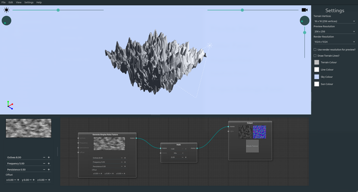
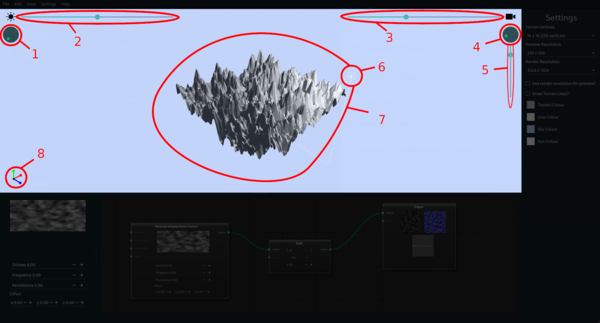
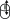
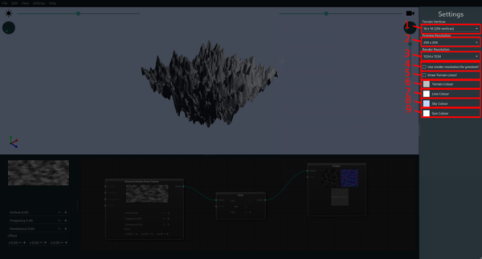
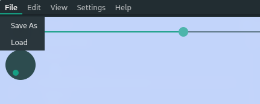

# Overview

Terrain Generator is an application for generating terrain height map and normal maps for usage in other applications. Game developers and artists can use this tool to generate terrain from a series of nodes. These nodes can be inputs (generated noise textures and loaded image textures), conversion nodes that change these inputs finalizing in an output node that is the resulting terrain.

## Navigation

Navigating the application is primarily done through a mouse and keyboard. The mouse is used to edit nodes placement, connections, and adjust the preview window as well as many settings.

### Preview Panel

The preview panel is the main area where you can preview the results of the generation plan created in the editor panel. Within this panel you can orbit the terrain and preview the effects from many angles, the sun and the camera can both be affected.

In order to orbit the camera you can adjust the range (**3**: which adjust the angle over the terrain) and dial (**4**: Which adjust the angle around the terrain), Alternatively you can simply click and drag on the preview screen .

In order to zoom in with the camera you can adjust the range (**5**) or by scrolling with the mouse wheel in the preview screen .

To adjust the suns angle you can adjust the dial (**1**: Which adjust the angle around the terrain) and the range (**2**: Which adjusts the angle over the terrain). Alternatively you can shift click and drag on the preview screen .

### Editor Panel

The editor panel is where the work is done to generate the terrain, here we can add nodes, connect nodes, and edit nodes to create a terrain generation program and preview the results for rendering out.

#### Adding Nodes

In order to add a node to the editor we right click in the dataflow diagram panel (**2**), which will show a menu to add nodes with.

From this menu we click on a node we want to add to the editor.

#### Connecting and Disconnecting Nodes

After adding node(s) to the editor we need to connect and adjust the pipelines, by default new nodes are not connected to any other node. To connect nodes we can click on a port and drag to another port to connect the two.

We can connect a single output to multiple inputs.

To disconnect a node we simply click on an input port and drag the connection off.

#### Editing Nodes

Some nodes have parameters that can be interacted with to change their effects. These parameters can be changed from the properties panel or by the controls on the node themselves.

### Settings Panel

The settings panel houses project settings that can be changed, these mainly affect the preview panel and performance.

1. A dropdown resolution selection for the number of vertices the terrain itself uses.
2. A dropdown resolution for the selected of the preview image resolution, this affects performance most while developing, this affects the height map during preview.
3. A dropdown resolution selection for the final resolution of the height map and normal map for rendering to the filesystem.
4. A checkbox to toggle the use of the render resolution (**3**) for preview purposes as well.
5. A checkbox whether to show vertex lines in the preview window, this will show the grid of the terrain if toggled.
6. A colour picker for the terrains default colour.
7. A colour picker for the terrain lines colour.
8. A colour picker for the sky (preview window background) colour.
9. A colour picker for the sun's colour.

## Saving and Loading

Saving and loading is done through the `File` menu dropdown.

### Saving

Selecting save will show a dialogue box to save the project file to.

Using the `Directory` button you select the output of the save file (defaults to your home directory). The filename input just below this is where you specify a filename, the extension is not necessary it is automatically placed in. Both of these must be set to save a project.

The `Pack External Resources` option is a checkbox as to whether loaded textures from the filesystem should be included in the save file. Check this option if you want your project to be more portable (multiple computers). If this option is not checked the textures are saved as a reference, producing a smaller save file that is not as well portable.

### Loading

Selected load will provide a file dialogue that is used to select the saved project file to load from.

## Rendering

To render the output of your terrain you can hit the `Render and Export` at the bottom of the settings panel. This will open up a dialogue to select for rendering and exporting your project.

In the render dialogue you select the output directory where you want to save the `heightmap.png` and the `normalmap.png` files. Ensure that the directory you select is either empty or does not contain files with the same name, these will be overwritten. Use the `Directory` button to select an output directory, hit `Ok` to begin the export progress, a progress dialogue will be shown. Hit `Cancel` to cancel this progress and return to the application.