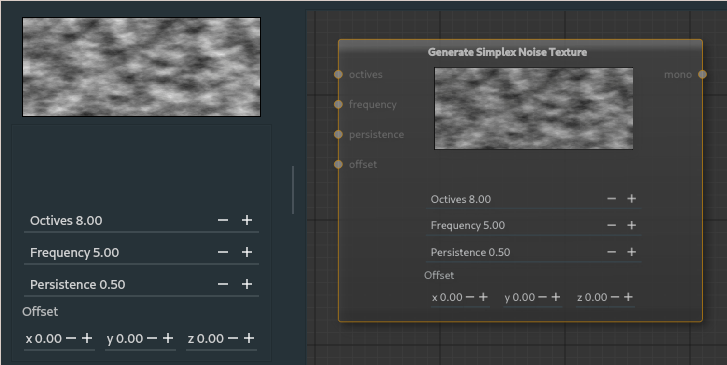

##### Simplex Noise Node

The simplex noise node generates a noise texture with smooth varying results.

---

**Ports**

The node has **4** input and **1** output port(s).

- **Input 1** (*octives*): The number of increased detail levels of type [mono](28_types.md).
- **Input 2** (*frequency*): The scale of the image of type [mono](28_types.md).
- **Input 3** (*persistence*): The level of consistency of type [mono](28_types.md).
- **Input 4** (*offset*): Shift of the image left/right (x), up/down (y), and in/out (z) of type [rgba](28_types.md).
- **Output 1** (*mono*): The resulting simplex noise texture of type [mono](28_types.md).

---

**Octives**: Effects the level of detail, each level does a new noise applied over the previous with less influence creating greater variance.

**Frequency**: Effects the scale of the image.

**Persistance**: Effects the smoothness of the image, how much influence the neighboring pixels have in generation.

**Offset**: Shifts the generated image left/right (x), up/down (y), or in/out (z).