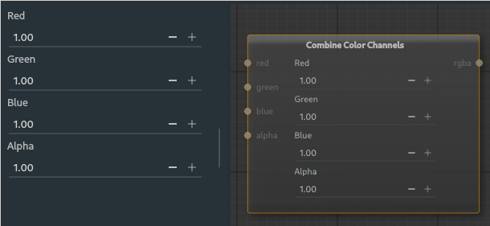

##### Colour Combine Node

The colour combine node takes in individual channels and outputs a single rgba map. If an input is not specified the channel is provided with the input. This node is opposite the to [colour split](colorsplit.md) node.

---

**Ports**

The node has **4** input and **1** output port(s).

- **Input 1** (*red*): The [mono](28_types.md) input for the **red** channel.
- **Input 2** (*green*): The [mono](28_types.md) input for the **green** channel.
- **Input 4** (*blue*): The [mono](28_types.md) input for the **blue** channel.
- **Input 3** (*alpha*): The [mono](28_types.md) input for the **alpha** channel.
- **Output 1** (*rgba*): The combined channels are outputted as [rgba](28_types.md).

---

The properties on the node are values that are used in place of the inputs, should a corresponding input is not done. These are values that can be any decimal number and is a vector output, for colour values they should remain in the [0-1] range.