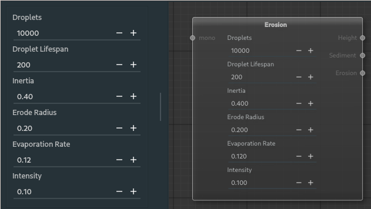

##### Erosion Simulation Node

The erosion simulation node applies hydraulic erosion simulation by simulating raindrop particles acting on the terrain. The input is manipulated through a variety of parameters that have plenty of effects on the terrain.

---

**Ports**

The node has **1** input and **3** output port(s).

- **Input 1** (*mono*): The input height map to be simulated on of type [mono](28_types.md).
- **Output 1** (*Height*): The resulting change in the height map of type [mono](28_types.md).
- **Output 2** (*Sediment*): The culmination of where sediment is moved to of type [mono](28_types.md).
- **Output 3** (*Erosion*): The culmination of where sediment is moved from of type [mono](28_types.md).

---

There are several inputs that affect the simulation.

**Droplets**: The number of raindrops to simulate. The more that are simulated the more the terrain is eroded. The fewer the less the terrain is affected.

**Droplet Lifespan**: The maximum amount of time a droplet can live. If the droplet goes out of the height map grid or stops moving it dies automatically, alternatively the droplet has a max number of calculation iterations as well. The high a droplet lives the longer it can erode.

**Inertia**: The effect of the gravity vs momentum on the node. The number ranges from [0-1]. If the inertia is 1 the droplet will move in a straight line ignoring the terrain. If it is 0 it will travel purely based on the terrain. A number between is better as it maintains momentum going over small edges while still following the terrain.

**Erode Radius**: The droplet radius of effect, determines the size of the area to erode from.

**Evaporation Rate**: Determines how fast the water evaporates. The water amount effects how much soil can be eroded and move, the faster it evaporates the quicker it stops eroding and moving soil.

**Intensity**: Directly effects a smoothing factor, the higher the number the less smooth the terrain is. The higher the value the more sharp the cuts appear.