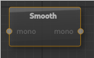

##### Smooth Node

The smoothing node applies a simple smoothing kernel to blur the map.

---

**Ports**

The node has **1** input and **1** output port(s).

- **Input 1** (*mono*): The input map to smooth of type [mono](28_types.md).
- **Output 1** (*mono*): The resulting smoothed map of type [mono](28_types.md).