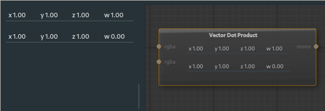

##### Vector Dot Product Node

The vector dot product node applies the vector dot product on two input [rgba](28_types.md) maps produces a [mono](28_types.md) output.

---

**Ports**

The node has **2** input and **1** output port(s).

- **Input 1** (*rgba*): The first vector map input.
- **Input 2** (*rgba*): The second vector map input.
- **Output 1** (*mono*): The resulting vector dot product [mono](28_types.md) map.

---

The top four inputs are for the first vector if the input node is not set (x, y, z, w) values.

The bottom four inputs are for the second vector if the input node is not set (x, y, z, w) values.