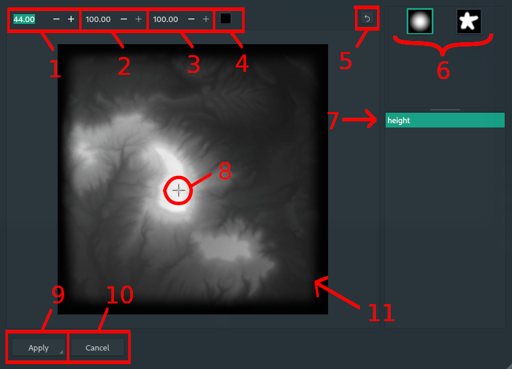

# Drawing Dialogue

The drawing dialogue, which is opened from '**...**' in a [Texture Node](07_texture.md), is used to draw basic images onto an existing texture. If the texture is created it is a blank white texture.

---

 &nbsp;&nbsp;&nbsp;Scrolling with the mouse window in the viewport will zoom the texture in/out.

 &nbsp;&nbsp;&nbsp;Left clicking and dragging in the viewport will draw the selected stencil with the selected options.

---

1. **Brush size**: This determines the size of the brush in pixels.
2. **Flow rate**: This determines the rate at which the stencil is placed, the higher the number the 'smoother' the line, the less so the more 'dotted' the placement.
3. **Opacity**: This effects the opacity of the stencil that gets placed, 100 places a solid colour, 0 places no stencil.
4. **Colour picker**: Use this to select the colour of the brush.
5. **Undo**: This button will undo recent history. `ctrl-z` is a the shortcut.
6. **Stencil selection**: This allows you to select a brush to draw with.
7. **Texture selection**: This is the selected texture being edited, any other textures here can be selected for editing.
8. **Cursor**: The cursor points to where you are drawing, the light grey circle around the cursor is the brush radius.
9. **Apply**: This is a destructive operation that applies all changes made in the history to the image. (Does not override textures on disk).
10. **Cancel**: Cancels any changes that have been made. Calls a dialogue confirming the cancellation if changes are not applied.
11. **Texture**: The viewport with the texture being edited.