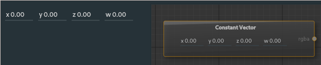

# Constant Vector Node

The constant vector node provides an output for an [rgba](types.md) constant vector that can be used in other nodes.

---

**Ports**

The node has **0** input and **1** output port(s).

- **Output 1** (*rgba*): The selected value is outputted as [rgba](types.md) data.

---

The input is a made of 4 values that define the *x*, *y*, *z*, and *w* values for the output vector map.