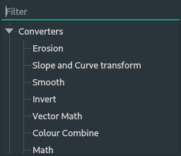

# Dataflow Panel

The dataflow editor is where the work is done. This is where nodes are created, edited, attached, and the generation is accomplished.

---

 &nbsp;&nbsp;&nbsp;Left click and dragging on a node moves it around.

 &nbsp;&nbsp;&nbsp;Left click and dragging on a node connection port creates a connection, let go to cancel or to connect to another node.

 &nbsp;&nbsp;&nbsp;Right click in the empty part of the panel to open up a menu to add nodes with:

---

## Nodes

### Input

- [Texture](texture.md) &mdash; Create a texture node that can be drawn on, link to existing images in the computer.
- [Simplex Noise](noise.md) &mdash; Create a generated smooth noise texture.
- [Constant Value](constantvalue.md) &mdash; Input for a single constant decimal number.
- [Constant Vector](constantvector.md) &mdash; Input for a single constant vector comprised of four constant decimal numbers.

### Converters

- [Curve and Slope](bezier.md) &mdash; Convert a height map using a function defined by a complex bézier curve.
- [Clamp](clamp.md) &mdash; Clamps values between two given values.
- [Colour Combine](colorcombine.md) &mdash; Combines four separate mono channels into a single rgba output.
- [Colour Split](colorsplit.md) &mdash; Splits a single rgba input into four separate mono channels.
- [Erosion Simulation](erosion.md) &mdash; Applies rainfall erosion simulation.
- [Invert](invert.md) &mdash; Inverts the input value.
- [Math](math.md) &mdash; Apply various mathematical functions to two input height maps.
- [Normalize](normalize.md) &mdash; Normalizes the input vector.
- [Smooth](smooth.md) &mdash; Apply a smoothing function to the intensity map. Smooth is done through a simple blur kernel.
- [Vector Dot Product](vectordot.md) &mdash; Applies vector dot product to two input vectors producing a single mono value output.
- [Vector To Intensity](vectorintensity.md) &mdash; Convert a vector value into a mono value using a selected method.
- [Vector Math](vectormath.md) &mdash; Apply element-wise mathematical functions to two vector maps.

### [Output](output.md)

- [Output](output.md) &mdash; The output of the node where the final height map is inputted to.