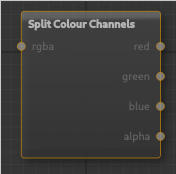

# Overview

The main application is setup into 4 distinct areas, the **preview** panel, the **properties** panel, the **dataflow** panel, and the **project settings** panel.

## The Preview Panel

The preview panel is made up of several information displays and widgets that can be interacted with to alter the preview window.

1. Rotates the **sun** around the terrain (turntable style).
2. Rotates the **sun** over the terrain, from 0 degrees (matching the horizon) to 90 degrees (directly above).
3. Rotates the **camera** over the terrain,  from 0 degrees (matching the horizon) to 90 degrees (directly above).
4. Rotates the **camera** around the terrain (turntable style).
5. Zooms the **camera** in and out of the screen.
6. Indicates the location of the **sun**. The location is the direction only, the sun is rendered as though it is far enough away the rays are parallel.
7. The preview of the **terrain** displays the results of the dataflow generation procedure, the output node must be set.
8. Indicates the rotation of the **camera** relative to the terrain, each of the colors represent an axis in the positive direction (green = y+, red = x+, blue = z+).

---

 &nbsp;&nbsp;&nbsp;Left clicking and dragging left/right anywhere in the preview panel will rotate the **camera** around the terrain (4).

 &nbsp;&nbsp;&nbsp;Left clicking and dragging up/down anywhere in the preview panel will rotate the **camera** over the terrain (3).

 &nbsp;&nbsp;&nbsp;Scrolling the mouse wheel zooms the **camera** in and out (5).

 &nbsp;&nbsp;&nbsp;Holding shift, left clicking, and dragging left/right anywhere in the preview panel will rotate the **sun** around the terrain (1).

 &nbsp;&nbsp;&nbsp;Holding shift, left clicking, and dragging up/down anywhere in the preview panel will rotate the **sun** over the terrain (2).

## Editor Panel

The nodeeditor is made up of two panels, the properties panel and the dataflow panel. This panel is used to design the system that generates the terrain. Adding, attaching, and running nodes to generate the terrain. The connection between nodes is done through one of two types of data mono or rgba.

1. Properties panel. For editing a selected nodes properties.
2. Dataflow panel. For creating and attaching nodes for the entire generation.
3. A specific node simplex noise (in this case) that is in the dataflow diagram.

### Properties Panel

The **properties** panel is part of the editor panel. This panel is shown when a node is created and has properties that can be edited or a node is double clicked and has properties that can be edited. If the node does not have editable properties this panel is not updated. If a node is deleted this panel is automatically hidden.

The properties that can be displayed in this panel is dependent on the node. See dataflow for a list of nodes.

### Dataflow Panel

The dataflow editor is where the work is done. This is where nodes are created, edited, attached, and the generation is accomplished.

---

 &nbsp;&nbsp;&nbsp;Left click and dragging on a node moves it around.

 &nbsp;&nbsp;&nbsp;Left click and dragging on a node connection port creates a connection, let go to cancel or to connect to another node.

 &nbsp;&nbsp;&nbsp;Right click in the empty part of the panel to open up a menu to add nodes with:

---

#### Nodes

#### Input

##### Texture Node

The texture node will be an input for loaded textures. Textures can be loaded from existing files in the system to a new created blank image.

---

**Ports**

The node has **0** input and **1** output port(s).

- **Output 1** (*rgba*): The texture output of type rgba.

---

**New**: Opens a dialogue to create a new image texture with a square resolution.

**Load**: Select an existing image file on system to use.

**...**: Open a drawing dialogue to simply edit the current texture. Most useful for editing new textures to create masks.

##### Simplex Noise Node

The simplex noise node generates a noise texture with smooth varying results.

---

**Ports**

The node has **4** input and **1** output port(s).

- **Input 1** (*octives*): The number of increased detail levels of type mono.
- **Input 2** (*frequency*): The scale of the image of type mono.
- **Input 3** (*persistence*): The level of consistency of type mono.
- **Input 4** (*offset*): Shift of the image left/right (x), up/down (y), and in/out (z) of type rgba.
- **Output 1** (*mono*): The resulting simplex noise texture of type mono.

---

**Octives**: Effects the level of detail, each level does a new noise applied over the previous with less influence creating greater variance.

**Frequency**: Effects the scale of the image.

**Persistance**: Effects the smoothness of the image, how much influence the neighboring pixels have in generation.

**Offset**: Shifts the generated image left/right (x), up/down (y), or in/out (z).

##### Constant Value Node

The constant value node provides an output for a single constant value that can be used in other nodes.

---

**Ports**

The node has **0** input and **1** output port(s).

- **Output 1** (*mono*): The selected value is outputted as mono data.

---

The input is a single decimal number value to be set.

##### Constant Vector Node

The constant vector node provides an output for an rgba constant vector that can be used in other nodes.

---

**Ports**

The node has **0** input and **1** output port(s).

- **Output 1** (*rgba*): The selected value is outputted as rgba data.

---

The input is a made of 4 values that define the *x*, *y*, *z*, and *w* values for the output vector map.

#### Converters

##### Slope and Curve Node

The slope and curve node converts an input value to a new output value following the formula of y = f(x), where f(x) is defined by the curve. To edit the curve simply click and drag the control points to adjust the curve. Double clicking on the curve will split the curve to add more detail. Control click a control point will snap it to an end point (does not do anything to an end point). Pressing x while hovering over a curve will delete the curve (1 curve will always remain).

---

**Ports**

The node has **1** input and **1** output port(s).

- **Input 1** (*mono*): The input is of type mono.
- **Output 1** (*mono*): The output is of type mono. The result of the transformation curve being applied on the input.

---

 &nbsp;&nbsp;&nbsp;Left click and drag a control point to adjust the curve.

 &nbsp;&nbsp;&nbsp;Double click on the curve will split the (sub)curve into two smaller curves that can be edited to add detail.

 &nbsp;&nbsp;&nbsp;Control clicking a control point will snap the control point to its matching end point. Creating a straight line.

 &nbsp;&nbsp;&nbsp;Pressing x while hovering on a curve will delete the sub-curve. If only one curve remains it will not be deleted.

##### Clamp Node

The clamp node clamps the input node between two values, a minimum and maximum. The min and max can be overwritten with inputs which take the min and max at the corresponding pixels. The mode drop down has the option for *Clamp* which will truncate values beyond the min and max to the min and max, or *Sigmoid* which clamps the value using a smooth function to the min and max.

---

**Ports**

The node has **3** input and **1** output port(s).

- **Input 1** (*mono*): The input to be clamping.
- **Input 2** (*min*): The minimum value to use.
- **Input 3** (*max*): The maximum value to use.
- **Output 1** (*mono*): The resulting clamp.

---

The first option is a dropdown select which allows you to select either to *Clamp* (hard limit the value) or *Sigmoid* (smooth clamp the value).

##### Colour Combine Node

The colour combine node takes in individual channels and outputs a single rgba map. If an input is not specified the channel is provided with the input. This node is opposite the to colour split node.

---

**Ports**

The node has **4** input and **1** output port(s).

- **Input 1** (*red*): The mono input for the **red** channel.
- **Input 2** (*green*): The mono input for the **green** channel.
- **Input 4** (*blue*): The mono input for the **blue** channel.
- **Input 3** (*alpha*): The mono input for the **alpha** channel.
- **Output 1** (*rgba*): The combined channels are outputted as rgba.

---

The properties on the node are values that are used in place of the inputs, should a corresponding input is not done. These are values that can be any decimal number and is a vector output, for colour values they should remain in the [0-1] range.

##### Colour Split Node

The colour split node takes in a single rgba map and splits each of the channel out into its own mono channel.

---

**Ports**

The node has **1** input and **4** output port(s).

- **Input 1** (*rgba*): The rgba input to be split out.
- **Output 1** (*red*): The mono out for the red channel.
- **Output 2** (*green*): The mono out for the green channel.
- **Output 3** (*blue*): The mono out for the blue channel.
- **Output 4** (*alpha*): The mono out for the alpha channel.

##### Erosion Simulation Node

The erosion simulation node applies hydraulic erosion simulation by simulating raindrop particles acting on the terrain. The input is manipulated through a variety of parameters that have plenty of effects on the terrain.

---

**Ports**

The node has **1** input and **3** output port(s).

- **Input 1** (*mono*): The input height map to be simulated on of type mono.
- **Output 1** (*Height*): The resulting change in the height map of type mono.
- **Output 2** (*Sediment*): The culmination of where sediment is moved to of type mono.
- **Output 3** (*Erosion*): The culmination of where sediment is moved from of type mono.

---

There are several inputs that affect the simulation.

**Droplets**: The number of raindrops to simulate. The more that are simulated the more the terrain is eroded. The fewer the less the terrain is affected.

**Droplet Lifespan**: The maximum amount of time a droplet can live. If the droplet goes out of the height map grid or stops moving it dies automatically, alternatively the droplet has a max number of calculation iterations as well. The high a droplet lives the longer it can erode.

**Inertia**: The effect of the gravity vs momentum on the node. The number ranges from [0-1]. If the inertia is 1 the droplet will move in a straight line ignoring the terrain. If it is 0 it will travel purely based on the terrain. A number between is better as it maintains momentum going over small edges while still following the terrain.

**Erode Radius**: The droplet radius of effect, determines the size of the area to erode from.

**Evaporation Rate**: Determines how fast the water evaporates. The water amount effects how much soil can be eroded and move, the faster it evaporates the quicker it stops eroding and moving soil.

**Intensity**: Directly effects a smoothing factor, the higher the number the less smooth the terrain is. The higher the value the more sharp the cuts appear.

##### Invert Node

Inverts an input mono map by applying the function 1 - *p* for each pixel *p*.

---

**Ports**

The node has **1** input and **1** output port(s).

- **Input 1** (*mono*): The input map to invert.
- **Output 1** (*mono*): The inverted input map is outputted.

##### Math Node

The math node applies a variety of mathematical operations on the two input mono maps producing a single output map.

---

**Ports**

The node has **2** input and **1** output port(s).

- **Input 1** (*mono*): The first value to use.
- **Input 2** (*mono*): The second value to use.
- **Output 1** (*mono*): The result of the operation.

---

The two numerical properties are defaults to be used if the input ports are not set.

The dropdown menu provides for a number of operations that can be applied on the values.

**Mix**: Blends the two values together *(a + b) / 2*.

**Add**: Adds the two values together *a + b*.

**Subtract**: Subtracts the bottom value from the top *a - b*.

**Multiply**: Multiplies the two values together *a * b*.

**Divide**: Divides the top value by the bottom value *a / b* (if *b* is 0 the resulting value is 0).

**Min**: Chooses the smallest of the two values.

**Max**: Chooses the largest of the two values.

**Pow**: Raises the top value by the bottom value *a^b*.

##### Normalize Node

Normalizes the vectors provided in the input.

---

**Ports**

The node has **1** input and **1** output port(s).

- **Input 1** (*mono*): The rgba map to normalize.
- **Output 1** (*mono*): The normalized rgba map from the input.

##### Smooth Node

The smoothing node applies a simple smoothing kernel to blur the map.

---

**Ports**

The node has **1** input and **1** output port(s).

- **Input 1** (*mono*): The input map to smooth of type mono.
- **Output 1** (*mono*): The resulting smoothed map of type mono.

##### Vector Dot Product Node

The vector dot product node applies the vector dot product on two input rgba maps produces a mono output.

---

**Ports**

The node has **2** input and **1** output port(s).

- **Input 1** (*rgba*): The first vector map input.
- **Input 2** (*rgba*): The second vector map input.
- **Output 1** (*mono*): The resulting vector dot product mono map.

---

The top four inputs are for the first vector if the input node is not set (x, y, z, w) values.

The bottom four inputs are for the second vector if the input node is not set (x, y, z, w) values.

##### Vector To Intensity Map Node

Converts an input rgba map to a mono map using a selected method of channel selection.

---

**Ports**

The node has **1** input and **1** output port(s).

- **Input 1** (*rgba*): The input vector map.
- **Output 1** (*mono*): The resulting mono map converted from the input map.

---

The options available are:

**Red**: Output only the red channel.

**Green**: Output only the green channel.

**Blue**: Output only the blue channel.

**Alpha**: Output only the alpha channel.

**Average**: Average the channels together *(r + g + b + a) / 4*.

**Min**: Selects the smallest of the four channels.

**Max**: Selects the largest of the four channels.

##### Vector Math Node

Used to apply element-wise vector map operations on two rgba maps.

---

**Ports**

The node has **2** input and **1** output port(s).

- **Input 1** (*rgba*): The first vector map.
- **Input 2** (*rgba*): The second vector map.
- **Output 1** (*rgba*): The resulting vector map.

---

The top row is the values for the first vector to be used if the input is not set (x, y, z, w).

The bottom row is the values for the second vector to be used if the input is not set (x, y, z, w).

The dropdown box has a selection of:

**Mix**: Average the two values together *(a + b) / 2*.

**Add**: Adds the two values together *a + b*.

**Subtract**: Subtracts the top vector by the bottom vector *a - b*.

**Component Multiply**: Multiplies each component value together *a * b = (x1 * x2, y1 * y2, z1 * z2, w1 * w2)*.

**Component Divide**: Divides the top by the bottom, each component value together *a / b = (x1 / x2, y1 / y2, z1 / z2, w1 / w2)*. (If the bottom value is 0 the result is 0).

**Cross Product**: Applies the cross product on the two vectors considering only the xyz values, the w is replaced with 1.

#### Output Node

The output node takes in a height map and generates its corresponding normal map, this node if active will update the preview window. The results that this node creates will be the rendered result.

---

**Ports**

The node has **2** input and **0** output port(s).

- **Input 1** (*mono*): The height map input of type mono.
- **Input 2** (*rgba*): An optional colour map for colouring the terrain of type rgba.

## Settings Panel

The **settings** panel houses several project level options. These options are saved on a per project basis and determine the preview image resolution, the resulting output rendering resolution, and the number of vertices seen in the mesh inside the preview panel.

1. Set the number of vertices the preview mesh uses.
2. Set the pixel resolution for use during development of the terrain.
3. Set the pixel resolution for when rendering the final height and normal maps.
4. Toggle as to use render settings for preview. If checked the render resolution will be used during preview as well as the final render.
5. Toggle as to whether or not to display mesh lines.
6. Change the override colour of the terrain.
7. Change the colour of lines displayed over the terrain (if lines is toggled).
8. Change the colour of background of the preview window and the sky colour.
9. Change the colour of sun.

# Drawing Dialogue

The drawing dialogue, which is opened from '**...**' in a Texture Node, is used to draw basic images onto an existing texture. If the texture is created it is a blank white texture.

---

 &nbsp;&nbsp;&nbsp;Scrolling with the mouse window in the viewport will zoom the texture in/out.

 &nbsp;&nbsp;&nbsp;Left clicking and dragging in the viewport will draw the selected stencil with the selected options.

---

1. **Brush size**: This determines the size of the brush in pixels.
2. **Flow rate**: This determines the rate at which the stencil is placed, the higher the number the 'smoother' the line, the less so the more 'dotted' the placement.
3. **Opacity**: This effects the opacity of the stencil that gets placed, 100 places a solid colour, 0 places no stencil.
4. **Colour picker**: Use this to select the colour of the brush.
5. **Undo**: This button will undo recent history. `ctrl-z` is a the shortcut.
6. **Stencil selection**: This allows you to select a brush to draw with.
7. **Texture selection**: This is the selected texture being edited, any other textures here can be selected for editing.
8. **Cursor**: The cursor points to where you are drawing, the light grey circle around the cursor is the brush radius.
9. **Apply**: This is a destructive operation that applies all changes made in the history to the image. (Does not override textures on disk).
10. **Cancel**: Cancels any changes that have been made. Calls a dialogue confirming the cancellation if changes are not applied.
11. **Texture**: The viewport with the texture being edited.

# Save Dialogue

The save dialogue is used to select an output for the project to be saved to.

---

1. Confirm the settings and save the project file.
2. Cancel the save.
3. Whether or not to pack external texture files (files loaded through the texture node) in with the save file, if this is not checked a reference to the texture is used. Use pack external if the save data needs to move between computers.
4. Select the output directory to save the file to.
5. Select the output filename to save the file to.

# Types

## Mono

The mono type is a 2 dimension map of single decimal numbers. The map can be of any size ranging from 1x1 to NxM.

## RGBA

The rgba type is a 2 dimension map of 4 decimal numbers. This corresponds to a 4 dimensional vector of decimal numbers (x, y, z, w). This also corresponds to a colour map of 4 values (r, g, b, a). (x=r, y=g, z=b, w=a)

# Overview

The main application is setup into 4 distinct areas, the **preview** panel, the **properties** panel, the **dataflow** panel, and the **project settings** panel.

## The Preview Panel

The preview panel is made up of several information displays and widgets that can be interacted with to alter the preview window.

1. Rotates the **sun** around the terrain (turntable style).
2. Rotates the **sun** over the terrain, from 0 degrees (matching the horizon) to 90 degrees (directly above).
3. Rotates the **camera** over the terrain,  from 0 degrees (matching the horizon) to 90 degrees (directly above).
4. Rotates the **camera** around the terrain (turntable style).
5. Zooms the **camera** in and out of the screen.
6. Indicates the location of the **sun**. The location is the direction only, the sun is rendered as though it is far enough away the rays are parallel.
7. The preview of the **terrain** displays the results of the dataflow generation procedure, the output node must be set.
8. Indicates the rotation of the **camera** relative to the terrain, each of the colors represent an axis in the positive direction (green = y+, red = x+, blue = z+).

---

 &nbsp;&nbsp;&nbsp;Left clicking and dragging left/right anywhere in the preview panel will rotate the **camera** around the terrain (4).

 &nbsp;&nbsp;&nbsp;Left clicking and dragging up/down anywhere in the preview panel will rotate the **camera** over the terrain (3).

 &nbsp;&nbsp;&nbsp;Scrolling the mouse wheel zooms the **camera** in and out (5).

 &nbsp;&nbsp;&nbsp;Holding shift, left clicking, and dragging left/right anywhere in the preview panel will rotate the **sun** around the terrain (1).

 &nbsp;&nbsp;&nbsp;Holding shift, left clicking, and dragging up/down anywhere in the preview panel will rotate the **sun** over the terrain (2).

## Editor Panel

The nodeeditor is made up of two panels, the properties panel and the dataflow panel. This panel is used to design the system that generates the terrain. Adding, attaching, and running nodes to generate the terrain. The connection between nodes is done through one of two types of data mono or rgba.

1. Properties panel. For editing a selected nodes properties.
2. Dataflow panel. For creating and attaching nodes for the entire generation.
3. A specific node simplex noise (in this case) that is in the dataflow diagram.

### Properties Panel

The **properties** panel is part of the editor panel. This panel is shown when a node is created and has properties that can be edited or a node is double clicked and has properties that can be edited. If the node does not have editable properties this panel is not updated. If a node is deleted this panel is automatically hidden.

The properties that can be displayed in this panel is dependent on the node. See dataflow for a list of nodes.

### Dataflow Panel

The dataflow editor is where the work is done. This is where nodes are created, edited, attached, and the generation is accomplished.

---

 &nbsp;&nbsp;&nbsp;Left click and dragging on a node moves it around.

 &nbsp;&nbsp;&nbsp;Left click and dragging on a node connection port creates a connection, let go to cancel or to connect to another node.

 &nbsp;&nbsp;&nbsp;Right click in the empty part of the panel to open up a menu to add nodes with:

---

#### Nodes

#### Input

##### Texture Node

The texture node will be an input for loaded textures. Textures can be loaded from existing files in the system to a new created blank image.

---

**Ports**

The node has **0** input and **1** output port(s).

- **Output 1** (*rgba*): The texture output of type rgba.

---

**New**: Opens a dialogue to create a new image texture with a square resolution.

**Load**: Select an existing image file on system to use.

**...**: Open a drawing dialogue to simply edit the current texture. Most useful for editing new textures to create masks.

##### Simplex Noise Node

The simplex noise node generates a noise texture with smooth varying results.

---

**Ports**

The node has **4** input and **1** output port(s).

- **Input 1** (*octives*): The number of increased detail levels of type mono.
- **Input 2** (*frequency*): The scale of the image of type mono.
- **Input 3** (*persistence*): The level of consistency of type mono.
- **Input 4** (*offset*): Shift of the image left/right (x), up/down (y), and in/out (z) of type rgba.
- **Output 1** (*mono*): The resulting simplex noise texture of type mono.

---

**Octives**: Effects the level of detail, each level does a new noise applied over the previous with less influence creating greater variance.

**Frequency**: Effects the scale of the image.

**Persistance**: Effects the smoothness of the image, how much influence the neighboring pixels have in generation.

**Offset**: Shifts the generated image left/right (x), up/down (y), or in/out (z).

##### Constant Value Node

The constant value node provides an output for a single constant value that can be used in other nodes.

---

**Ports**

The node has **0** input and **1** output port(s).

- **Output 1** (*mono*): The selected value is outputted as mono data.

---

The input is a single decimal number value to be set.

##### Constant Vector Node

The constant vector node provides an output for an rgba constant vector that can be used in other nodes.

---

**Ports**

The node has **0** input and **1** output port(s).

- **Output 1** (*rgba*): The selected value is outputted as rgba data.

---

The input is a made of 4 values that define the *x*, *y*, *z*, and *w* values for the output vector map.

#### Converters

##### Slope and Curve Node

The slope and curve node converts an input value to a new output value following the formula of y = f(x), where f(x) is defined by the curve. To edit the curve simply click and drag the control points to adjust the curve. Double clicking on the curve will split the curve to add more detail. Control click a control point will snap it to an end point (does not do anything to an end point). Pressing x while hovering over a curve will delete the curve (1 curve will always remain).

---

**Ports**

The node has **1** input and **1** output port(s).

- **Input 1** (*mono*): The input is of type mono.
- **Output 1** (*mono*): The output is of type mono. The result of the transformation curve being applied on the input.

---

 &nbsp;&nbsp;&nbsp;Left click and drag a control point to adjust the curve.

 &nbsp;&nbsp;&nbsp;Double click on the curve will split the (sub)curve into two smaller curves that can be edited to add detail.

 &nbsp;&nbsp;&nbsp;Control clicking a control point will snap the control point to its matching end point. Creating a straight line.

 &nbsp;&nbsp;&nbsp;Pressing x while hovering on a curve will delete the sub-curve. If only one curve remains it will not be deleted.

##### Clamp Node

The clamp node clamps the input node between two values, a minimum and maximum. The min and max can be overwritten with inputs which take the min and max at the corresponding pixels. The mode drop down has the option for *Clamp* which will truncate values beyond the min and max to the min and max, or *Sigmoid* which clamps the value using a smooth function to the min and max.

---

**Ports**

The node has **3** input and **1** output port(s).

- **Input 1** (*mono*): The input to be clamping.
- **Input 2** (*min*): The minimum value to use.
- **Input 3** (*max*): The maximum value to use.
- **Output 1** (*mono*): The resulting clamp.

---

The first option is a dropdown select which allows you to select either to *Clamp* (hard limit the value) or *Sigmoid* (smooth clamp the value).

##### Colour Combine Node

The colour combine node takes in individual channels and outputs a single rgba map. If an input is not specified the channel is provided with the input. This node is opposite the to colour split node.

---

**Ports**

The node has **4** input and **1** output port(s).

- **Input 1** (*red*): The mono input for the **red** channel.
- **Input 2** (*green*): The mono input for the **green** channel.
- **Input 4** (*blue*): The mono input for the **blue** channel.
- **Input 3** (*alpha*): The mono input for the **alpha** channel.
- **Output 1** (*rgba*): The combined channels are outputted as rgba.

---

The properties on the node are values that are used in place of the inputs, should a corresponding input is not done. These are values that can be any decimal number and is a vector output, for colour values they should remain in the [0-1] range.

##### Colour Split Node

The colour split node takes in a single rgba map and splits each of the channel out into its own mono channel.

---

**Ports**

The node has **1** input and **4** output port(s).

- **Input 1** (*rgba*): The rgba input to be split out.
- **Output 1** (*red*): The mono out for the red channel.
- **Output 2** (*green*): The mono out for the green channel.
- **Output 3** (*blue*): The mono out for the blue channel.
- **Output 4** (*alpha*): The mono out for the alpha channel.

##### Erosion Simulation Node

The erosion simulation node applies hydraulic erosion simulation by simulating raindrop particles acting on the terrain. The input is manipulated through a variety of parameters that have plenty of effects on the terrain.

---

**Ports**

The node has **1** input and **3** output port(s).

- **Input 1** (*mono*): The input height map to be simulated on of type mono.
- **Output 1** (*Height*): The resulting change in the height map of type mono.
- **Output 2** (*Sediment*): The culmination of where sediment is moved to of type mono.
- **Output 3** (*Erosion*): The culmination of where sediment is moved from of type mono.

---

There are several inputs that affect the simulation.

**Droplets**: The number of raindrops to simulate. The more that are simulated the more the terrain is eroded. The fewer the less the terrain is affected.

**Droplet Lifespan**: The maximum amount of time a droplet can live. If the droplet goes out of the height map grid or stops moving it dies automatically, alternatively the droplet has a max number of calculation iterations as well. The high a droplet lives the longer it can erode.

**Inertia**: The effect of the gravity vs momentum on the node. The number ranges from [0-1]. If the inertia is 1 the droplet will move in a straight line ignoring the terrain. If it is 0 it will travel purely based on the terrain. A number between is better as it maintains momentum going over small edges while still following the terrain.

**Erode Radius**: The droplet radius of effect, determines the size of the area to erode from.

**Evaporation Rate**: Determines how fast the water evaporates. The water amount effects how much soil can be eroded and move, the faster it evaporates the quicker it stops eroding and moving soil.

**Intensity**: Directly effects a smoothing factor, the higher the number the less smooth the terrain is. The higher the value the more sharp the cuts appear.

##### Invert Node

Inverts an input mono map by applying the function 1 - *p* for each pixel *p*.

---

**Ports**

The node has **1** input and **1** output port(s).

- **Input 1** (*mono*): The input map to invert.
- **Output 1** (*mono*): The inverted input map is outputted.

##### Math Node

The math node applies a variety of mathematical operations on the two input mono maps producing a single output map.

---

**Ports**

The node has **2** input and **1** output port(s).

- **Input 1** (*mono*): The first value to use.
- **Input 2** (*mono*): The second value to use.
- **Output 1** (*mono*): The result of the operation.

---

The two numerical properties are defaults to be used if the input ports are not set.

The dropdown menu provides for a number of operations that can be applied on the values.

**Mix**: Blends the two values together *(a + b) / 2*.

**Add**: Adds the two values together *a + b*.

**Subtract**: Subtracts the bottom value from the top *a - b*.

**Multiply**: Multiplies the two values together *a * b*.

**Divide**: Divides the top value by the bottom value *a / b* (if *b* is 0 the resulting value is 0).

**Min**: Chooses the smallest of the two values.

**Max**: Chooses the largest of the two values.

**Pow**: Raises the top value by the bottom value *a^b*.

##### Normalize Node

Normalizes the vectors provided in the input.

---

**Ports**

The node has **1** input and **1** output port(s).

- **Input 1** (*mono*): The rgba map to normalize.
- **Output 1** (*mono*): The normalized rgba map from the input.

##### Smooth Node

The smoothing node applies a simple smoothing kernel to blur the map.

---

**Ports**

The node has **1** input and **1** output port(s).

- **Input 1** (*mono*): The input map to smooth of type mono.
- **Output 1** (*mono*): The resulting smoothed map of type mono.

##### Vector Dot Product Node

The vector dot product node applies the vector dot product on two input rgba maps produces a mono output.

---

**Ports**

The node has **2** input and **1** output port(s).

- **Input 1** (*rgba*): The first vector map input.
- **Input 2** (*rgba*): The second vector map input.
- **Output 1** (*mono*): The resulting vector dot product mono map.

---

The top four inputs are for the first vector if the input node is not set (x, y, z, w) values.

The bottom four inputs are for the second vector if the input node is not set (x, y, z, w) values.

##### Vector To Intensity Map Node

Converts an input rgba map to a mono map using a selected method of channel selection.

---

**Ports**

The node has **1** input and **1** output port(s).

- **Input 1** (*rgba*): The input vector map.
- **Output 1** (*mono*): The resulting mono map converted from the input map.

---

The options available are:

**Red**: Output only the red channel.

**Green**: Output only the green channel.

**Blue**: Output only the blue channel.

**Alpha**: Output only the alpha channel.

**Average**: Average the channels together *(r + g + b + a) / 4*.

**Min**: Selects the smallest of the four channels.

**Max**: Selects the largest of the four channels.

##### Vector Math Node

Used to apply element-wise vector map operations on two rgba maps.

---

**Ports**

The node has **2** input and **1** output port(s).

- **Input 1** (*rgba*): The first vector map.
- **Input 2** (*rgba*): The second vector map.
- **Output 1** (*rgba*): The resulting vector map.

---

The top row is the values for the first vector to be used if the input is not set (x, y, z, w).

The bottom row is the values for the second vector to be used if the input is not set (x, y, z, w).

The dropdown box has a selection of:

**Mix**: Average the two values together *(a + b) / 2*.

**Add**: Adds the two values together *a + b*.

**Subtract**: Subtracts the top vector by the bottom vector *a - b*.

**Component Multiply**: Multiplies each component value together *a * b = (x1 * x2, y1 * y2, z1 * z2, w1 * w2)*.

**Component Divide**: Divides the top by the bottom, each component value together *a / b = (x1 / x2, y1 / y2, z1 / z2, w1 / w2)*. (If the bottom value is 0 the result is 0).

**Cross Product**: Applies the cross product on the two vectors considering only the xyz values, the w is replaced with 1.

#### Output Node

The output node takes in a height map and generates its corresponding normal map, this node if active will update the preview window. The results that this node creates will be the rendered result.

---

**Ports**

The node has **2** input and **0** output port(s).

- **Input 1** (*mono*): The height map input of type mono.
- **Input 2** (*rgba*): An optional colour map for colouring the terrain of type rgba.

## Settings Panel

The **settings** panel houses several project level options. These options are saved on a per project basis and determine the preview image resolution, the resulting output rendering resolution, and the number of vertices seen in the mesh inside the preview panel.

1. Set the number of vertices the preview mesh uses.
2. Set the pixel resolution for use during development of the terrain.
3. Set the pixel resolution for when rendering the final height and normal maps.
4. Toggle as to use render settings for preview. If checked the render resolution will be used during preview as well as the final render.
5. Toggle as to whether or not to display mesh lines.
6. Change the override colour of the terrain.
7. Change the colour of lines displayed over the terrain (if lines is toggled).
8. Change the colour of background of the preview window and the sky colour.
9. Change the colour of sun.

# Drawing Dialogue

The drawing dialogue, which is opened from '**...**' in a Texture Node, is used to draw basic images onto an existing texture. If the texture is created it is a blank white texture.

---

 &nbsp;&nbsp;&nbsp;Scrolling with the mouse window in the viewport will zoom the texture in/out.

 &nbsp;&nbsp;&nbsp;Left clicking and dragging in the viewport will draw the selected stencil with the selected options.

---

1. **Brush size**: This determines the size of the brush in pixels.
2. **Flow rate**: This determines the rate at which the stencil is placed, the higher the number the 'smoother' the line, the less so the more 'dotted' the placement.
3. **Opacity**: This effects the opacity of the stencil that gets placed, 100 places a solid colour, 0 places no stencil.
4. **Colour picker**: Use this to select the colour of the brush.
5. **Undo**: This button will undo recent history. `ctrl-z` is a the shortcut.
6. **Stencil selection**: This allows you to select a brush to draw with.
7. **Texture selection**: This is the selected texture being edited, any other textures here can be selected for editing.
8. **Cursor**: The cursor points to where you are drawing, the light grey circle around the cursor is the brush radius.
9. **Apply**: This is a destructive operation that applies all changes made in the history to the image. (Does not override textures on disk).
10. **Cancel**: Cancels any changes that have been made. Calls a dialogue confirming the cancellation if changes are not applied.
11. **Texture**: The viewport with the texture being edited.

# Save Dialogue

The save dialogue is used to select an output for the project to be saved to.

---

1. Confirm the settings and save the project file.
2. Cancel the save.
3. Whether or not to pack external texture files (files loaded through the texture node) in with the save file, if this is not checked a reference to the texture is used. Use pack external if the save data needs to move between computers.
4. Select the output directory to save the file to.
5. Select the output filename to save the file to.

# Types

## Mono

The mono type is a 2 dimension map of single decimal numbers. The map can be of any size ranging from 1x1 to NxM.

## RGBA

The rgba type is a 2 dimension map of 4 decimal numbers. This corresponds to a 4 dimensional vector of decimal numbers (x, y, z, w). This also corresponds to a colour map of 4 values (r, g, b, a). (x=r, y=g, z=b, w=a)

# Overview

The main application is setup into 4 distinct areas, the **preview** panel, the **properties** panel, the **dataflow** panel, and the **project settings** panel.

## The Preview Panel

The preview panel is made up of several information displays and widgets that can be interacted with to alter the preview window.

1. Rotates the **sun** around the terrain (turntable style).
2. Rotates the **sun** over the terrain, from 0 degrees (matching the horizon) to 90 degrees (directly above).
3. Rotates the **camera** over the terrain,  from 0 degrees (matching the horizon) to 90 degrees (directly above).
4. Rotates the **camera** around the terrain (turntable style).
5. Zooms the **camera** in and out of the screen.
6. Indicates the location of the **sun**. The location is the direction only, the sun is rendered as though it is far enough away the rays are parallel.
7. The preview of the **terrain** displays the results of the dataflow generation procedure, the output node must be set.
8. Indicates the rotation of the **camera** relative to the terrain, each of the colors represent an axis in the positive direction (green = y+, red = x+, blue = z+).

---

 &nbsp;&nbsp;&nbsp;Left clicking and dragging left/right anywhere in the preview panel will rotate the **camera** around the terrain (4).

 &nbsp;&nbsp;&nbsp;Left clicking and dragging up/down anywhere in the preview panel will rotate the **camera** over the terrain (3).

 &nbsp;&nbsp;&nbsp;Scrolling the mouse wheel zooms the **camera** in and out (5).

 &nbsp;&nbsp;&nbsp;Holding shift, left clicking, and dragging left/right anywhere in the preview panel will rotate the **sun** around the terrain (1).

 &nbsp;&nbsp;&nbsp;Holding shift, left clicking, and dragging up/down anywhere in the preview panel will rotate the **sun** over the terrain (2).

## Editor Panel

The nodeeditor is made up of two panels, the properties panel and the dataflow panel. This panel is used to design the system that generates the terrain. Adding, attaching, and running nodes to generate the terrain. The connection between nodes is done through one of two types of data mono or rgba.

1. Properties panel. For editing a selected nodes properties.
2. Dataflow panel. For creating and attaching nodes for the entire generation.
3. A specific node simplex noise (in this case) that is in the dataflow diagram.

### Properties Panel

The **properties** panel is part of the editor panel. This panel is shown when a node is created and has properties that can be edited or a node is double clicked and has properties that can be edited. If the node does not have editable properties this panel is not updated. If a node is deleted this panel is automatically hidden.

The properties that can be displayed in this panel is dependent on the node. See dataflow for a list of nodes.

### Dataflow Panel

The dataflow editor is where the work is done. This is where nodes are created, edited, attached, and the generation is accomplished.

---

 &nbsp;&nbsp;&nbsp;Left click and dragging on a node moves it around.

 &nbsp;&nbsp;&nbsp;Left click and dragging on a node connection port creates a connection, let go to cancel or to connect to another node.

 &nbsp;&nbsp;&nbsp;Right click in the empty part of the panel to open up a menu to add nodes with:

---

#### Nodes

#### Input

##### Texture Node

The texture node will be an input for loaded textures. Textures can be loaded from existing files in the system to a new created blank image.

---

**Ports**

The node has **0** input and **1** output port(s).

- **Output 1** (*rgba*): The texture output of type rgba.

---

**New**: Opens a dialogue to create a new image texture with a square resolution.

**Load**: Select an existing image file on system to use.

**...**: Open a drawing dialogue to simply edit the current texture. Most useful for editing new textures to create masks.

##### Simplex Noise Node

The simplex noise node generates a noise texture with smooth varying results.

---

**Ports**

The node has **4** input and **1** output port(s).

- **Input 1** (*octives*): The number of increased detail levels of type mono.
- **Input 2** (*frequency*): The scale of the image of type mono.
- **Input 3** (*persistence*): The level of consistency of type mono.
- **Input 4** (*offset*): Shift of the image left/right (x), up/down (y), and in/out (z) of type rgba.
- **Output 1** (*mono*): The resulting simplex noise texture of type mono.

---

**Octives**: Effects the level of detail, each level does a new noise applied over the previous with less influence creating greater variance.

**Frequency**: Effects the scale of the image.

**Persistance**: Effects the smoothness of the image, how much influence the neighboring pixels have in generation.

**Offset**: Shifts the generated image left/right (x), up/down (y), or in/out (z).

##### Constant Value Node

The constant value node provides an output for a single constant value that can be used in other nodes.

---

**Ports**

The node has **0** input and **1** output port(s).

- **Output 1** (*mono*): The selected value is outputted as mono data.

---

The input is a single decimal number value to be set.

##### Constant Vector Node

The constant vector node provides an output for an rgba constant vector that can be used in other nodes.

---

**Ports**

The node has **0** input and **1** output port(s).

- **Output 1** (*rgba*): The selected value is outputted as rgba data.

---

The input is a made of 4 values that define the *x*, *y*, *z*, and *w* values for the output vector map.

#### Converters

##### Slope and Curve Node

The slope and curve node converts an input value to a new output value following the formula of y = f(x), where f(x) is defined by the curve. To edit the curve simply click and drag the control points to adjust the curve. Double clicking on the curve will split the curve to add more detail. Control click a control point will snap it to an end point (does not do anything to an end point). Pressing x while hovering over a curve will delete the curve (1 curve will always remain).

---

**Ports**

The node has **1** input and **1** output port(s).

- **Input 1** (*mono*): The input is of type mono.
- **Output 1** (*mono*): The output is of type mono. The result of the transformation curve being applied on the input.

---

 &nbsp;&nbsp;&nbsp;Left click and drag a control point to adjust the curve.

 &nbsp;&nbsp;&nbsp;Double click on the curve will split the (sub)curve into two smaller curves that can be edited to add detail.

 &nbsp;&nbsp;&nbsp;Control clicking a control point will snap the control point to its matching end point. Creating a straight line.

 &nbsp;&nbsp;&nbsp;Pressing x while hovering on a curve will delete the sub-curve. If only one curve remains it will not be deleted.

##### Clamp Node

The clamp node clamps the input node between two values, a minimum and maximum. The min and max can be overwritten with inputs which take the min and max at the corresponding pixels. The mode drop down has the option for *Clamp* which will truncate values beyond the min and max to the min and max, or *Sigmoid* which clamps the value using a smooth function to the min and max.

---

**Ports**

The node has **3** input and **1** output port(s).

- **Input 1** (*mono*): The input to be clamping.
- **Input 2** (*min*): The minimum value to use.
- **Input 3** (*max*): The maximum value to use.
- **Output 1** (*mono*): The resulting clamp.

---

The first option is a dropdown select which allows you to select either to *Clamp* (hard limit the value) or *Sigmoid* (smooth clamp the value).

##### Colour Combine Node

The colour combine node takes in individual channels and outputs a single rgba map. If an input is not specified the channel is provided with the input. This node is opposite the to colour split node.

---

**Ports**

The node has **4** input and **1** output port(s).

- **Input 1** (*red*): The mono input for the **red** channel.
- **Input 2** (*green*): The mono input for the **green** channel.
- **Input 4** (*blue*): The mono input for the **blue** channel.
- **Input 3** (*alpha*): The mono input for the **alpha** channel.
- **Output 1** (*rgba*): The combined channels are outputted as rgba.

---

The properties on the node are values that are used in place of the inputs, should a corresponding input is not done. These are values that can be any decimal number and is a vector output, for colour values they should remain in the [0-1] range.

##### Colour Split Node

The colour split node takes in a single rgba map and splits each of the channel out into its own mono channel.

---

**Ports**

The node has **1** input and **4** output port(s).

- **Input 1** (*rgba*): The rgba input to be split out.
- **Output 1** (*red*): The mono out for the red channel.
- **Output 2** (*green*): The mono out for the green channel.
- **Output 3** (*blue*): The mono out for the blue channel.
- **Output 4** (*alpha*): The mono out for the alpha channel.

##### Erosion Simulation Node

The erosion simulation node applies hydraulic erosion simulation by simulating raindrop particles acting on the terrain. The input is manipulated through a variety of parameters that have plenty of effects on the terrain.

---

**Ports**

The node has **1** input and **3** output port(s).

- **Input 1** (*mono*): The input height map to be simulated on of type mono.
- **Output 1** (*Height*): The resulting change in the height map of type mono.
- **Output 2** (*Sediment*): The culmination of where sediment is moved to of type mono.
- **Output 3** (*Erosion*): The culmination of where sediment is moved from of type mono.

---

There are several inputs that affect the simulation.

**Droplets**: The number of raindrops to simulate. The more that are simulated the more the terrain is eroded. The fewer the less the terrain is affected.

**Droplet Lifespan**: The maximum amount of time a droplet can live. If the droplet goes out of the height map grid or stops moving it dies automatically, alternatively the droplet has a max number of calculation iterations as well. The high a droplet lives the longer it can erode.

**Inertia**: The effect of the gravity vs momentum on the node. The number ranges from [0-1]. If the inertia is 1 the droplet will move in a straight line ignoring the terrain. If it is 0 it will travel purely based on the terrain. A number between is better as it maintains momentum going over small edges while still following the terrain.

**Erode Radius**: The droplet radius of effect, determines the size of the area to erode from.

**Evaporation Rate**: Determines how fast the water evaporates. The water amount effects how much soil can be eroded and move, the faster it evaporates the quicker it stops eroding and moving soil.

**Intensity**: Directly effects a smoothing factor, the higher the number the less smooth the terrain is. The higher the value the more sharp the cuts appear.

##### Invert Node

Inverts an input mono map by applying the function 1 - *p* for each pixel *p*.

---

**Ports**

The node has **1** input and **1** output port(s).

- **Input 1** (*mono*): The input map to invert.
- **Output 1** (*mono*): The inverted input map is outputted.

##### Math Node

The math node applies a variety of mathematical operations on the two input mono maps producing a single output map.

---

**Ports**

The node has **2** input and **1** output port(s).

- **Input 1** (*mono*): The first value to use.
- **Input 2** (*mono*): The second value to use.
- **Output 1** (*mono*): The result of the operation.

---

The two numerical properties are defaults to be used if the input ports are not set.

The dropdown menu provides for a number of operations that can be applied on the values.

**Mix**: Blends the two values together *(a + b) / 2*.

**Add**: Adds the two values together *a + b*.

**Subtract**: Subtracts the bottom value from the top *a - b*.

**Multiply**: Multiplies the two values together *a * b*.

**Divide**: Divides the top value by the bottom value *a / b* (if *b* is 0 the resulting value is 0).

**Min**: Chooses the smallest of the two values.

**Max**: Chooses the largest of the two values.

**Pow**: Raises the top value by the bottom value *a^b*.

##### Normalize Node

Normalizes the vectors provided in the input.

---

**Ports**

The node has **1** input and **1** output port(s).

- **Input 1** (*mono*): The rgba map to normalize.
- **Output 1** (*mono*): The normalized rgba map from the input.

##### Smooth Node

The smoothing node applies a simple smoothing kernel to blur the map.

---

**Ports**

The node has **1** input and **1** output port(s).

- **Input 1** (*mono*): The input map to smooth of type mono.
- **Output 1** (*mono*): The resulting smoothed map of type mono.

##### Vector Dot Product Node

The vector dot product node applies the vector dot product on two input rgba maps produces a mono output.

---

**Ports**

The node has **2** input and **1** output port(s).

- **Input 1** (*rgba*): The first vector map input.
- **Input 2** (*rgba*): The second vector map input.
- **Output 1** (*mono*): The resulting vector dot product mono map.

---

The top four inputs are for the first vector if the input node is not set (x, y, z, w) values.

The bottom four inputs are for the second vector if the input node is not set (x, y, z, w) values.

##### Vector To Intensity Map Node

Converts an input rgba map to a mono map using a selected method of channel selection.

---

**Ports**

The node has **1** input and **1** output port(s).

- **Input 1** (*rgba*): The input vector map.
- **Output 1** (*mono*): The resulting mono map converted from the input map.

---

The options available are:

**Red**: Output only the red channel.

**Green**: Output only the green channel.

**Blue**: Output only the blue channel.

**Alpha**: Output only the alpha channel.

**Average**: Average the channels together *(r + g + b + a) / 4*.

**Min**: Selects the smallest of the four channels.

**Max**: Selects the largest of the four channels.

##### Vector Math Node

Used to apply element-wise vector map operations on two rgba maps.

---

**Ports**

The node has **2** input and **1** output port(s).

- **Input 1** (*rgba*): The first vector map.
- **Input 2** (*rgba*): The second vector map.
- **Output 1** (*rgba*): The resulting vector map.

---

The top row is the values for the first vector to be used if the input is not set (x, y, z, w).

The bottom row is the values for the second vector to be used if the input is not set (x, y, z, w).

The dropdown box has a selection of:

**Mix**: Average the two values together *(a + b) / 2*.

**Add**: Adds the two values together *a + b*.

**Subtract**: Subtracts the top vector by the bottom vector *a - b*.

**Component Multiply**: Multiplies each component value together *a * b = (x1 * x2, y1 * y2, z1 * z2, w1 * w2)*.

**Component Divide**: Divides the top by the bottom, each component value together *a / b = (x1 / x2, y1 / y2, z1 / z2, w1 / w2)*. (If the bottom value is 0 the result is 0).

**Cross Product**: Applies the cross product on the two vectors considering only the xyz values, the w is replaced with 1.

#### Output Node

The output node takes in a height map and generates its corresponding normal map, this node if active will update the preview window. The results that this node creates will be the rendered result.

---

**Ports**

The node has **2** input and **0** output port(s).

- **Input 1** (*mono*): The height map input of type mono.
- **Input 2** (*rgba*): An optional colour map for colouring the terrain of type rgba.

## Settings Panel

The **settings** panel houses several project level options. These options are saved on a per project basis and determine the preview image resolution, the resulting output rendering resolution, and the number of vertices seen in the mesh inside the preview panel.

1. Set the number of vertices the preview mesh uses.
2. Set the pixel resolution for use during development of the terrain.
3. Set the pixel resolution for when rendering the final height and normal maps.
4. Toggle as to use render settings for preview. If checked the render resolution will be used during preview as well as the final render.
5. Toggle as to whether or not to display mesh lines.
6. Change the override colour of the terrain.
7. Change the colour of lines displayed over the terrain (if lines is toggled).
8. Change the colour of background of the preview window and the sky colour.
9. Change the colour of sun.

# Drawing Dialogue

The drawing dialogue, which is opened from '**...**' in a Texture Node, is used to draw basic images onto an existing texture. If the texture is created it is a blank white texture.

---

 &nbsp;&nbsp;&nbsp;Scrolling with the mouse window in the viewport will zoom the texture in/out.

 &nbsp;&nbsp;&nbsp;Left clicking and dragging in the viewport will draw the selected stencil with the selected options.

---

1. **Brush size**: This determines the size of the brush in pixels.
2. **Flow rate**: This determines the rate at which the stencil is placed, the higher the number the 'smoother' the line, the less so the more 'dotted' the placement.
3. **Opacity**: This effects the opacity of the stencil that gets placed, 100 places a solid colour, 0 places no stencil.
4. **Colour picker**: Use this to select the colour of the brush.
5. **Undo**: This button will undo recent history. `ctrl-z` is a the shortcut.
6. **Stencil selection**: This allows you to select a brush to draw with.
7. **Texture selection**: This is the selected texture being edited, any other textures here can be selected for editing.
8. **Cursor**: The cursor points to where you are drawing, the light grey circle around the cursor is the brush radius.
9. **Apply**: This is a destructive operation that applies all changes made in the history to the image. (Does not override textures on disk).
10. **Cancel**: Cancels any changes that have been made. Calls a dialogue confirming the cancellation if changes are not applied.
11. **Texture**: The viewport with the texture being edited.

# Save Dialogue

The save dialogue is used to select an output for the project to be saved to.

---

1. Confirm the settings and save the project file.
2. Cancel the save.
3. Whether or not to pack external texture files (files loaded through the texture node) in with the save file, if this is not checked a reference to the texture is used. Use pack external if the save data needs to move between computers.
4. Select the output directory to save the file to.
5. Select the output filename to save the file to.

# Types

## Mono

The mono type is a 2 dimension map of single decimal numbers. The map can be of any size ranging from 1x1 to NxM.

## RGBA

The rgba type is a 2 dimension map of 4 decimal numbers. This corresponds to a 4 dimensional vector of decimal numbers (x, y, z, w). This also corresponds to a colour map of 4 values (r, g, b, a). (x=r, y=g, z=b, w=a)

# Overview

The main application is setup into 4 distinct areas, the **preview** panel, the **properties** panel, the **dataflow** panel, and the **project settings** panel.

## The Preview Panel

The preview panel is made up of several information displays and widgets that can be interacted with to alter the preview window.

1. Rotates the **sun** around the terrain (turntable style).
2. Rotates the **sun** over the terrain, from 0 degrees (matching the horizon) to 90 degrees (directly above).
3. Rotates the **camera** over the terrain,  from 0 degrees (matching the horizon) to 90 degrees (directly above).
4. Rotates the **camera** around the terrain (turntable style).
5. Zooms the **camera** in and out of the screen.
6. Indicates the location of the **sun**. The location is the direction only, the sun is rendered as though it is far enough away the rays are parallel.
7. The preview of the **terrain** displays the results of the dataflow generation procedure, the output node must be set.
8. Indicates the rotation of the **camera** relative to the terrain, each of the colors represent an axis in the positive direction (green = y+, red = x+, blue = z+).

---

 &nbsp;&nbsp;&nbsp;Left clicking and dragging left/right anywhere in the preview panel will rotate the **camera** around the terrain (4).

 &nbsp;&nbsp;&nbsp;Left clicking and dragging up/down anywhere in the preview panel will rotate the **camera** over the terrain (3).

 &nbsp;&nbsp;&nbsp;Scrolling the mouse wheel zooms the **camera** in and out (5).

 &nbsp;&nbsp;&nbsp;Holding shift, left clicking, and dragging left/right anywhere in the preview panel will rotate the **sun** around the terrain (1).

 &nbsp;&nbsp;&nbsp;Holding shift, left clicking, and dragging up/down anywhere in the preview panel will rotate the **sun** over the terrain (2).

## Editor Panel

The nodeeditor is made up of two panels, the properties panel and the dataflow panel. This panel is used to design the system that generates the terrain. Adding, attaching, and running nodes to generate the terrain. The connection between nodes is done through one of two types of data mono or rgba.

1. Properties panel. For editing a selected nodes properties.
2. Dataflow panel. For creating and attaching nodes for the entire generation.
3. A specific node simplex noise (in this case) that is in the dataflow diagram.

### Properties Panel

The **properties** panel is part of the editor panel. This panel is shown when a node is created and has properties that can be edited or a node is double clicked and has properties that can be edited. If the node does not have editable properties this panel is not updated. If a node is deleted this panel is automatically hidden.

The properties that can be displayed in this panel is dependent on the node. See dataflow for a list of nodes.

### Dataflow Panel

The dataflow editor is where the work is done. This is where nodes are created, edited, attached, and the generation is accomplished.

---

 &nbsp;&nbsp;&nbsp;Left click and dragging on a node moves it around.

 &nbsp;&nbsp;&nbsp;Left click and dragging on a node connection port creates a connection, let go to cancel or to connect to another node.

 &nbsp;&nbsp;&nbsp;Right click in the empty part of the panel to open up a menu to add nodes with:

---

#### Nodes

#### Input

##### Texture Node

The texture node will be an input for loaded textures. Textures can be loaded from existing files in the system to a new created blank image.

---

**Ports**

The node has **0** input and **1** output port(s).

- **Output 1** (*rgba*): The texture output of type rgba.

---

**New**: Opens a dialogue to create a new image texture with a square resolution.

**Load**: Select an existing image file on system to use.

**...**: Open a drawing dialogue to simply edit the current texture. Most useful for editing new textures to create masks.

##### Simplex Noise Node

The simplex noise node generates a noise texture with smooth varying results.

---

**Ports**

The node has **4** input and **1** output port(s).

- **Input 1** (*octives*): The number of increased detail levels of type mono.
- **Input 2** (*frequency*): The scale of the image of type mono.
- **Input 3** (*persistence*): The level of consistency of type mono.
- **Input 4** (*offset*): Shift of the image left/right (x), up/down (y), and in/out (z) of type rgba.
- **Output 1** (*mono*): The resulting simplex noise texture of type mono.

---

**Octives**: Effects the level of detail, each level does a new noise applied over the previous with less influence creating greater variance.

**Frequency**: Effects the scale of the image.

**Persistance**: Effects the smoothness of the image, how much influence the neighboring pixels have in generation.

**Offset**: Shifts the generated image left/right (x), up/down (y), or in/out (z).

##### Constant Value Node

The constant value node provides an output for a single constant value that can be used in other nodes.

---

**Ports**

The node has **0** input and **1** output port(s).

- **Output 1** (*mono*): The selected value is outputted as mono data.

---

The input is a single decimal number value to be set.

##### Constant Vector Node

The constant vector node provides an output for an rgba constant vector that can be used in other nodes.

---

**Ports**

The node has **0** input and **1** output port(s).

- **Output 1** (*rgba*): The selected value is outputted as rgba data.

---

The input is a made of 4 values that define the *x*, *y*, *z*, and *w* values for the output vector map.

#### Converters

##### Slope and Curve Node

The slope and curve node converts an input value to a new output value following the formula of y = f(x), where f(x) is defined by the curve. To edit the curve simply click and drag the control points to adjust the curve. Double clicking on the curve will split the curve to add more detail. Control click a control point will snap it to an end point (does not do anything to an end point). Pressing x while hovering over a curve will delete the curve (1 curve will always remain).

---

**Ports**

The node has **1** input and **1** output port(s).

- **Input 1** (*mono*): The input is of type mono.
- **Output 1** (*mono*): The output is of type mono. The result of the transformation curve being applied on the input.

---

 &nbsp;&nbsp;&nbsp;Left click and drag a control point to adjust the curve.

 &nbsp;&nbsp;&nbsp;Double click on the curve will split the (sub)curve into two smaller curves that can be edited to add detail.

 &nbsp;&nbsp;&nbsp;Control clicking a control point will snap the control point to its matching end point. Creating a straight line.

 &nbsp;&nbsp;&nbsp;Pressing x while hovering on a curve will delete the sub-curve. If only one curve remains it will not be deleted.

##### Clamp Node

The clamp node clamps the input node between two values, a minimum and maximum. The min and max can be overwritten with inputs which take the min and max at the corresponding pixels. The mode drop down has the option for *Clamp* which will truncate values beyond the min and max to the min and max, or *Sigmoid* which clamps the value using a smooth function to the min and max.

---

**Ports**

The node has **3** input and **1** output port(s).

- **Input 1** (*mono*): The input to be clamping.
- **Input 2** (*min*): The minimum value to use.
- **Input 3** (*max*): The maximum value to use.
- **Output 1** (*mono*): The resulting clamp.

---

The first option is a dropdown select which allows you to select either to *Clamp* (hard limit the value) or *Sigmoid* (smooth clamp the value).

##### Colour Combine Node

The colour combine node takes in individual channels and outputs a single rgba map. If an input is not specified the channel is provided with the input. This node is opposite the to colour split node.

---

**Ports**

The node has **4** input and **1** output port(s).

- **Input 1** (*red*): The mono input for the **red** channel.
- **Input 2** (*green*): The mono input for the **green** channel.
- **Input 4** (*blue*): The mono input for the **blue** channel.
- **Input 3** (*alpha*): The mono input for the **alpha** channel.
- **Output 1** (*rgba*): The combined channels are outputted as rgba.

---

The properties on the node are values that are used in place of the inputs, should a corresponding input is not done. These are values that can be any decimal number and is a vector output, for colour values they should remain in the [0-1] range.

##### Colour Split Node

The colour split node takes in a single rgba map and splits each of the channel out into its own mono channel.

---

**Ports**

The node has **1** input and **4** output port(s).

- **Input 1** (*rgba*): The rgba input to be split out.
- **Output 1** (*red*): The mono out for the red channel.
- **Output 2** (*green*): The mono out for the green channel.
- **Output 3** (*blue*): The mono out for the blue channel.
- **Output 4** (*alpha*): The mono out for the alpha channel.

##### Erosion Simulation Node

The erosion simulation node applies hydraulic erosion simulation by simulating raindrop particles acting on the terrain. The input is manipulated through a variety of parameters that have plenty of effects on the terrain.

---

**Ports**

The node has **1** input and **3** output port(s).

- **Input 1** (*mono*): The input height map to be simulated on of type mono.
- **Output 1** (*Height*): The resulting change in the height map of type mono.
- **Output 2** (*Sediment*): The culmination of where sediment is moved to of type mono.
- **Output 3** (*Erosion*): The culmination of where sediment is moved from of type mono.

---

There are several inputs that affect the simulation.

**Droplets**: The number of raindrops to simulate. The more that are simulated the more the terrain is eroded. The fewer the less the terrain is affected.

**Droplet Lifespan**: The maximum amount of time a droplet can live. If the droplet goes out of the height map grid or stops moving it dies automatically, alternatively the droplet has a max number of calculation iterations as well. The high a droplet lives the longer it can erode.

**Inertia**: The effect of the gravity vs momentum on the node. The number ranges from [0-1]. If the inertia is 1 the droplet will move in a straight line ignoring the terrain. If it is 0 it will travel purely based on the terrain. A number between is better as it maintains momentum going over small edges while still following the terrain.

**Erode Radius**: The droplet radius of effect, determines the size of the area to erode from.

**Evaporation Rate**: Determines how fast the water evaporates. The water amount effects how much soil can be eroded and move, the faster it evaporates the quicker it stops eroding and moving soil.

**Intensity**: Directly effects a smoothing factor, the higher the number the less smooth the terrain is. The higher the value the more sharp the cuts appear.

##### Invert Node

Inverts an input mono map by applying the function 1 - *p* for each pixel *p*.

---

**Ports**

The node has **1** input and **1** output port(s).

- **Input 1** (*mono*): The input map to invert.
- **Output 1** (*mono*): The inverted input map is outputted.

##### Math Node

The math node applies a variety of mathematical operations on the two input mono maps producing a single output map.

---

**Ports**

The node has **2** input and **1** output port(s).

- **Input 1** (*mono*): The first value to use.
- **Input 2** (*mono*): The second value to use.
- **Output 1** (*mono*): The result of the operation.

---

The two numerical properties are defaults to be used if the input ports are not set.

The dropdown menu provides for a number of operations that can be applied on the values.

**Mix**: Blends the two values together *(a + b) / 2*.

**Add**: Adds the two values together *a + b*.

**Subtract**: Subtracts the bottom value from the top *a - b*.

**Multiply**: Multiplies the two values together *a * b*.

**Divide**: Divides the top value by the bottom value *a / b* (if *b* is 0 the resulting value is 0).

**Min**: Chooses the smallest of the two values.

**Max**: Chooses the largest of the two values.

**Pow**: Raises the top value by the bottom value *a^b*.

##### Normalize Node

Normalizes the vectors provided in the input.

---

**Ports**

The node has **1** input and **1** output port(s).

- **Input 1** (*mono*): The rgba map to normalize.
- **Output 1** (*mono*): The normalized rgba map from the input.

##### Smooth Node

The smoothing node applies a simple smoothing kernel to blur the map.

---

**Ports**

The node has **1** input and **1** output port(s).

- **Input 1** (*mono*): The input map to smooth of type mono.
- **Output 1** (*mono*): The resulting smoothed map of type mono.

##### Vector Dot Product Node

The vector dot product node applies the vector dot product on two input rgba maps produces a mono output.

---

**Ports**

The node has **2** input and **1** output port(s).

- **Input 1** (*rgba*): The first vector map input.
- **Input 2** (*rgba*): The second vector map input.
- **Output 1** (*mono*): The resulting vector dot product mono map.

---

The top four inputs are for the first vector if the input node is not set (x, y, z, w) values.

The bottom four inputs are for the second vector if the input node is not set (x, y, z, w) values.

##### Vector To Intensity Map Node

Converts an input rgba map to a mono map using a selected method of channel selection.

---

**Ports**

The node has **1** input and **1** output port(s).

- **Input 1** (*rgba*): The input vector map.
- **Output 1** (*mono*): The resulting mono map converted from the input map.

---

The options available are:

**Red**: Output only the red channel.

**Green**: Output only the green channel.

**Blue**: Output only the blue channel.

**Alpha**: Output only the alpha channel.

**Average**: Average the channels together *(r + g + b + a) / 4*.

**Min**: Selects the smallest of the four channels.

**Max**: Selects the largest of the four channels.

##### Vector Math Node

Used to apply element-wise vector map operations on two rgba maps.

---

**Ports**

The node has **2** input and **1** output port(s).

- **Input 1** (*rgba*): The first vector map.
- **Input 2** (*rgba*): The second vector map.
- **Output 1** (*rgba*): The resulting vector map.

---

The top row is the values for the first vector to be used if the input is not set (x, y, z, w).

The bottom row is the values for the second vector to be used if the input is not set (x, y, z, w).

The dropdown box has a selection of:

**Mix**: Average the two values together *(a + b) / 2*.

**Add**: Adds the two values together *a + b*.

**Subtract**: Subtracts the top vector by the bottom vector *a - b*.

**Component Multiply**: Multiplies each component value together *a * b = (x1 * x2, y1 * y2, z1 * z2, w1 * w2)*.

**Component Divide**: Divides the top by the bottom, each component value together *a / b = (x1 / x2, y1 / y2, z1 / z2, w1 / w2)*. (If the bottom value is 0 the result is 0).

**Cross Product**: Applies the cross product on the two vectors considering only the xyz values, the w is replaced with 1.

#### Output Node

The output node takes in a height map and generates its corresponding normal map, this node if active will update the preview window. The results that this node creates will be the rendered result.

---

**Ports**

The node has **2** input and **0** output port(s).

- **Input 1** (*mono*): The height map input of type mono.
- **Input 2** (*rgba*): An optional colour map for colouring the terrain of type rgba.

## Settings Panel

The **settings** panel houses several project level options. These options are saved on a per project basis and determine the preview image resolution, the resulting output rendering resolution, and the number of vertices seen in the mesh inside the preview panel.

1. Set the number of vertices the preview mesh uses.
2. Set the pixel resolution for use during development of the terrain.
3. Set the pixel resolution for when rendering the final height and normal maps.
4. Toggle as to use render settings for preview. If checked the render resolution will be used during preview as well as the final render.
5. Toggle as to whether or not to display mesh lines.
6. Change the override colour of the terrain.
7. Change the colour of lines displayed over the terrain (if lines is toggled).
8. Change the colour of background of the preview window and the sky colour.
9. Change the colour of sun.

# Drawing Dialogue

The drawing dialogue, which is opened from '**...**' in a Texture Node, is used to draw basic images onto an existing texture. If the texture is created it is a blank white texture.

---

 &nbsp;&nbsp;&nbsp;Scrolling with the mouse window in the viewport will zoom the texture in/out.

 &nbsp;&nbsp;&nbsp;Left clicking and dragging in the viewport will draw the selected stencil with the selected options.

---

1. **Brush size**: This determines the size of the brush in pixels.
2. **Flow rate**: This determines the rate at which the stencil is placed, the higher the number the 'smoother' the line, the less so the more 'dotted' the placement.
3. **Opacity**: This effects the opacity of the stencil that gets placed, 100 places a solid colour, 0 places no stencil.
4. **Colour picker**: Use this to select the colour of the brush.
5. **Undo**: This button will undo recent history. `ctrl-z` is a the shortcut.
6. **Stencil selection**: This allows you to select a brush to draw with.
7. **Texture selection**: This is the selected texture being edited, any other textures here can be selected for editing.
8. **Cursor**: The cursor points to where you are drawing, the light grey circle around the cursor is the brush radius.
9. **Apply**: This is a destructive operation that applies all changes made in the history to the image. (Does not override textures on disk).
10. **Cancel**: Cancels any changes that have been made. Calls a dialogue confirming the cancellation if changes are not applied.
11. **Texture**: The viewport with the texture being edited.

# Save Dialogue

The save dialogue is used to select an output for the project to be saved to.

---

1. Confirm the settings and save the project file.
2. Cancel the save.
3. Whether or not to pack external texture files (files loaded through the texture node) in with the save file, if this is not checked a reference to the texture is used. Use pack external if the save data needs to move between computers.
4. Select the output directory to save the file to.
5. Select the output filename to save the file to.

# Types

## Mono

The mono type is a 2 dimension map of single decimal numbers. The map can be of any size ranging from 1x1 to NxM.

## RGBA

The rgba type is a 2 dimension map of 4 decimal numbers. This corresponds to a 4 dimensional vector of decimal numbers (x, y, z, w). This also corresponds to a colour map of 4 values (r, g, b, a). (x=r, y=g, z=b, w=a)

