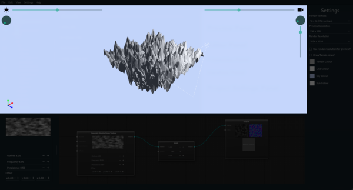
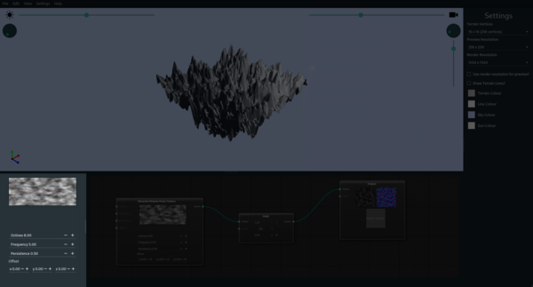

## [Preview Panel](02_preview.md)

The preview panel displays the output of the generated height map that is piped into the output node in the dataflow diagram.

## [Editor Panel](03_editor.md)

The editor panel is divided into two components, the properties panel: that can be used to update selected nodes properties; and the dataflow panel: that is used to connect the nodes and create terrain generation.

### [Properties Panel](04_properties.md)

The properties panel shows a copy of controls of a selected node. The values are synced with the embedded nodes properties and can be updated from here.

### [Dataflow Panel](05_dataflow.md)

The dataflow panel is where the terrain generation is done from. The nodes here connect to define the procedure to generate the terrain.

## [Project Settings Panel](25_settings.md)

The settings panel houses project specific settings (separate from application settings in the menubar), these settings are preview and output resolution of images, the preview window colours, and other settings.

