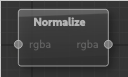

# Normalize Node

Normalizes the vectors provided in the input.

---

**Ports**

The node has **1** input and **1** output port(s).

- **Input 1** (*mono*): The [rgba](types.md) map to normalize.
- **Output 1** (*mono*): The normalized [rgba](types.md) map from the input.