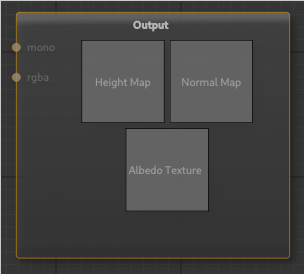

# Output Node

The output node takes in a height map and generates its corresponding normal map, this node if active will update the preview window. The results that this node creates will be the rendered result.

---

**Ports**

The node has **2** input and **0** output port(s).

- **Input 1** (*mono*): The height map input of type [mono](types.md).
- **Input 2** (*rgba*): An optional colour map for colouring the terrain of type [rgba](types.md).