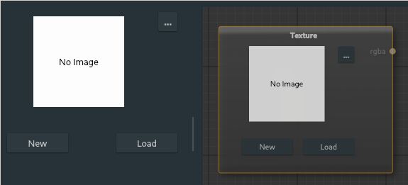

# Texture Node

The texture node will be an input for loaded textures. Textures can be loaded from existing files in the system to a new created blank image.

---

**Ports**

The node has **0** input and **1** output port(s).

- **Output 1** (*rgba*): The texture output of type [rgba](types.md).

---

**New**: Opens a dialogue to create a new image texture with a square resolution.

**Load**: Select an existing image file on system to use.

**...**: Open a drawing dialogue to simply edit the current texture. Most useful for editing new textures to create masks.