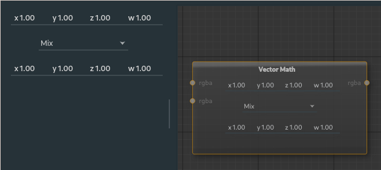

# Vector Math Node

Used to apply element-wise vector map operations on two [rgba](types.md) maps.

---

**Ports**

The node has **2** input and **1** output port(s).

- **Input 1** (*rgba*): The first vector map.
- **Input 2** (*rgba*): The second vector map.
- **Output 1** (*rgba*): The resulting vector map.

---

The top row is the values for the first vector to be used if the input is not set (x, y, z, w).

The bottom row is the values for the second vector to be used if the input is not set (x, y, z, w).

The dropdown box has a selection of:

**Mix**: Average the two values together *(a + b) / 2*.

**Add**: Adds the two values together *a + b*.

**Subtract**: Subtracts the top vector by the bottom vector *a - b*.

**Component Multiply**: Multiplies each component value together *a * b = (x1 * x2, y1 * y2, z1 * z2, w1 * w2)*.

**Component Divide**: Divides the top by the bottom, each component value together *a / b = (x1 / x2, y1 / y2, z1 / z2, w1 / w2)*. (If the bottom value is 0 the result is 0).

**Cross Product**: Applies the cross product on the two vectors considering only the xyz values, the w is replaced with 1.